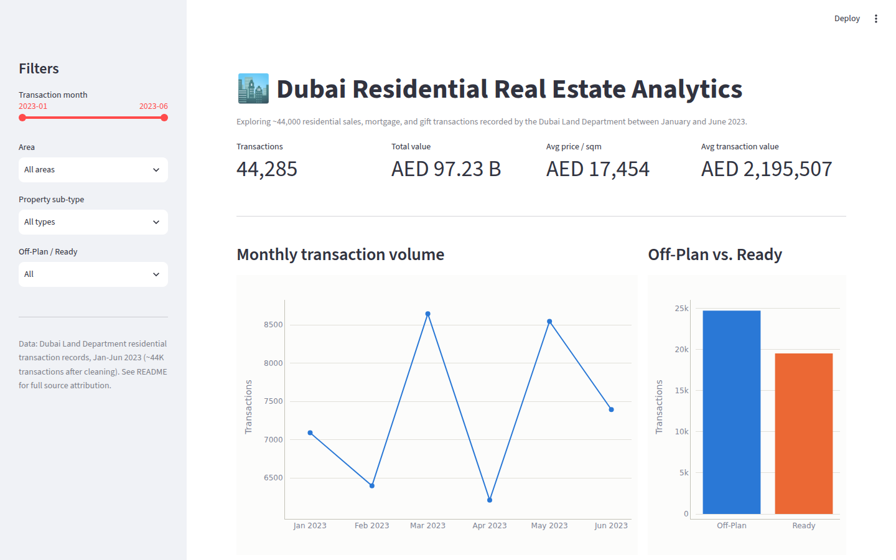
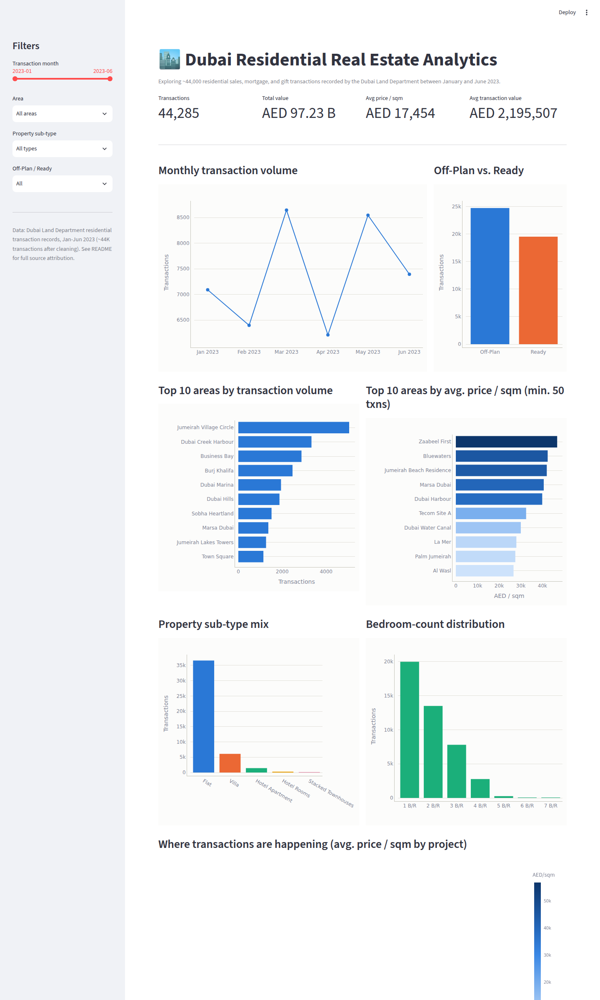

# Dubai Residential Real Estate Analytics Dashboard

An interactive analytics dashboard exploring ~44,000 Dubai residential property
transactions (sales, mortgages, and gifts) recorded between January and June 2023,
built to demonstrate a full analyst workflow: raw data → SQL data layer →
interactive BI dashboard.

**Live dashboard:** not yet deployed — see "Deploying it" below to add a live Streamlit Community Cloud link

## What it does

- Cleans and validates ~44.7K raw transaction records (currency parsing, date
  parsing, outlier trimming) into a queryable SQLite database.
- Provides a SQL analysis layer (`sql/analysis_queries.sql`) with 9 queries
  covering KPIs, trends, area comparisons, and a window-function query for
  month-on-month price movement by area.
- Serves an interactive Streamlit dashboard with filters (date range, area,
  property sub-type, off-plan/ready), KPI tiles, trend and comparison charts,
  and a project-level map colored by average price per square metre.

## Key findings

- **Off-plan properties transacted at a ~39% premium** in average price per
  sqm over ready properties (AED 19,941/sqm vs AED 14,301/sqm) — consistent
  with off-plan pricing for future completion and payment-plan structuring.
- **Jumeirah Village Circle, Dubai Creek Harbour, and Business Bay** were the
  three highest-volume areas by transaction count, together accounting for
  roughly a quarter of all transactions in the period.
- **Zaabeel First, Bluewaters, and Jumeirah Beach Residence** had the highest
  average price per sqm (AED 42–47K) among areas with at least 50 transactions,
  while **Liwan, Al Khail Heights, and Remraam** were the most affordable
  (AED 5–6K/sqm) — a roughly 8x spread across the market.
- **1-bedroom units drove volume** (~45% of all transactions), with flats
  outnumbering villas roughly 6 to 1.
- Monthly transaction count fluctuated between ~6,200 and ~8,650, with March
  and May as the strongest months in H1 2023.

## Data source

Original source: **Dubai Land Department (DLD)** open real estate transaction
data (dubailand.gov.ae). Accessed for this project via a public GitHub mirror
compiled for a Northwestern University data science bootcamp capstone
([jaezak/dubai_housing_predictions](https://github.com/jaezak/dubai_housing_predictions)),
covering residential transactions from January to June 2023. The dataset is
used here strictly for independent, non-commercial portfolio analysis; no
buyer/seller identity fields are present in the data.

## Tech stack

Python, pandas, SQLite, SQL (aggregations, `HAVING`, window functions),
Streamlit, Plotly.

## Project structure

```
dubai_real_estate_dashboard/
├── app.py                     # Streamlit dashboard
├── requirements.txt
├── data/
│   └── dubai_residential_transactions.csv.gz   # raw source data (gzipped to keep the repo small)
│                                                # dubai_real_estate.db is built locally, not committed
├── scripts/
│   └── build_database.py      # cleans the CSV and builds the SQLite DB
├── sql/
│   └── analysis_queries.sql   # standalone SQL analysis (9 queries)
└── screenshots/
```

## Running it locally

```bash
pip install -r requirements.txt
python scripts/build_database.py   # first run only — builds data/dubai_real_estate.db
streamlit run app.py
```

## Deploying it (so the résumé link is a live demo, not just a repo)

1. Push this folder to a public GitHub repo.
2. Go to [share.streamlit.io](https://share.streamlit.io), sign in with GitHub,
   and deploy the repo (`app.py` as the entry point). It's free for public repos.
3. Add the resulting URL to the top of this README and to your résumé project link.

## Screenshots




## Notes on methodology

- 448 records (~1%) were excluded as price-per-sqm outliers using a 0.5th/99.5th
  percentile clip — a standard, disclosed approach to prevent a small number of
  likely data-entry errors from distorting area-level averages. All figures above
  are computed after this cleaning step.
- The map layer uses project-level coordinates provided in the source data,
  aggregated to projects with 5+ transactions to avoid single-sale noise.
